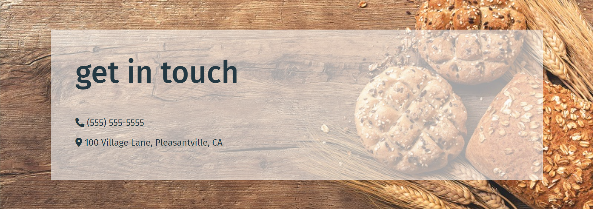
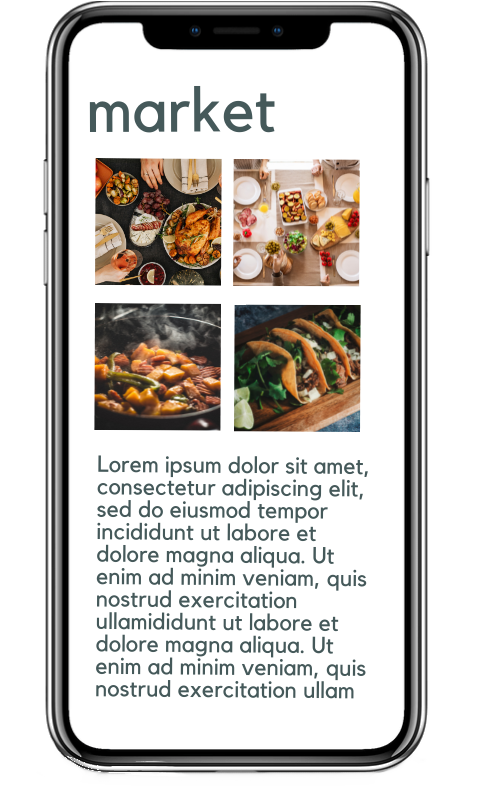

<h1 align="center">Daily UI Day 03: Splash Page</h1>

<p align="center">
This is a splash page for Daily UI's Day 03 challenge for the <a href="https://www.dailyui.co/"> 100 Days of UI 
challange.</a></p>


## Links

- [Repo](https://github.com/kelseychristensen/Daily-UI-Day-03 "Daily UI Day 03 Repo")
- [Dribbble](https://dribbble.com/shots/19952876-Daily-UI-Day-02-Credit-Card-Form "Dribbble Link")

## Screenshots





## My process

### Built with

- HTML
- CSS
- Bootstrap
- 
### What went into this project

This turned into a challenge within a challenge. Because I wanted to use mockups in my design for this fictional app website, I had to design the UI of those too (although I focused way less on that UI than the site UI).

I made the mockups in Canva and gave them a transparent background in GIMP before moving them into my IDE project. Then, I used pure CSS to position them before styling the rest of the website.

### What I learned

I learned a lot about absolute positioning, hiding overflows, and transforms in this challenge: it felt like cheating to make an image of the mockups to use as a background, so they are all placed there. That being said, this site would need a LOT of retooling to be responsive.

I worked 

### Continued development

I would love to learn more about how developers that create really glossy, modern websites (with things like mockups going every which way) that are responsive! I imagine it takes a lot of work to make a design look good as people not only change media, but just their window width and height! I really  want to learn more about what goes into a process like that.

```html
<div class="about">
<div class="container">
  <div class="row">
    <div class="col-6"></div>
    <div class="col-6" ><h2>meal planning just got better</h2>
        <p class="about-text">Lorem ipsum dolor sit amet, consectetur adipiscing elit, sed do eiusmod tempor incididunt ut labore et dolore magna aliqua. Ut enim ad minim veniam, quis nostrud exercitation ullamco laboris nisi ut aliquip ex ea commodo consequat
</div>

```
```css
.mkt_mockup {
    width: 20%;
    transform: rotate(-20deg);
    position: absolute;
    top: 10vh;
    right: 5vw;
}
```
## Author

Kelsey Christensen

- [Profile](https://github.com/kelseychristensen "Kelsey Christensen")
- [Email](mailto:kelsey.c.christensen@gmail.com?subject=Hi "Hi!")
- [Dribble](https://dribbble.com/kelseychristensen "Hi!")
- [Website](http://kelseychristensen.com/ "Welcome")
